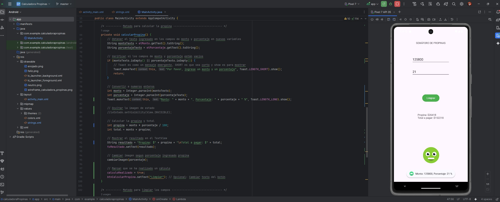
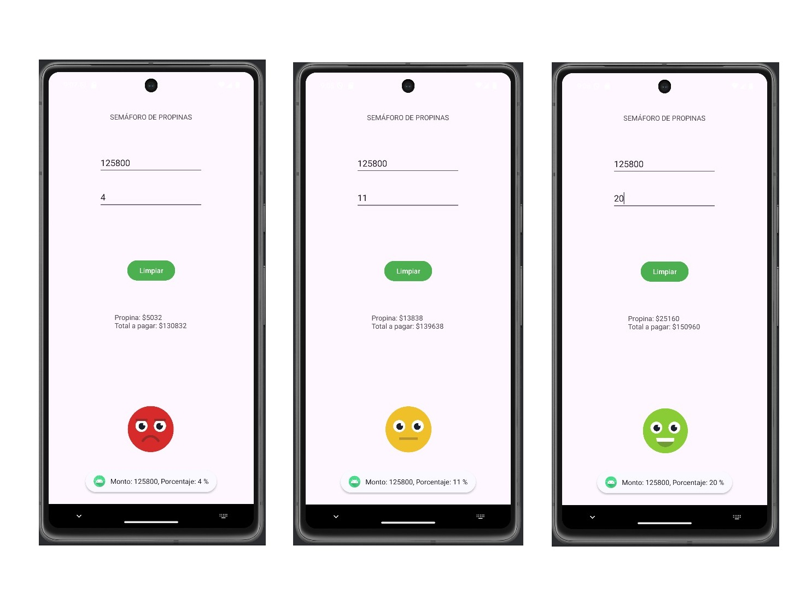

**_<h1 align="center">:vulcan_salute: Proyecto Realizado con Andoid Studio - Hola Mundo:computer:</h1>_**

**<h3>:blue_book: Contexto del Proyecto:</h3>**

<p>Este proyecto consiste en ingresar un monto de cuenta o compra y el porcentaje de propina que se va a dar.</p>
<p>Según el monto de la propina, se va a reaccionar con emojis de colores tipo semaforo:</p>
<ul>
    <li>Propina baja: Carita roja enojada</li>
    <li>Propina media: Carita amarilla neutra</li>
    <li>Propina alta: Carita verde feliz</li>
</ul>
<p>El proyecto fue realizado con Android Studio, utilizando Java y Kotlin.</p>
<p>Para poder probar con diferentes valores, se habilito en el botón de calcular la opción de limpiar los campos para poder ingresar nuevos valores.</p>


**<h3>:book: Link a video en Youtube que muestra proyecto ejecutado:</h3>**

<p align="center">
  <a href="https://www.youtube.com/watch?v=6VQe9vkByBM" target="_blank">
    
  </a>
</p>

<p align="center">
  ▶️ <a href="https://www.youtube.com/watch?v=6VQe9vkByBM" target="_blank"><b>Ver en YouTube</b></a>
</p>

**<h3>📁 Estructura del Proyecto Android:</h3>**

```Android
📘 README.md
📁 app
├── 📁 manifest
│   └── 🟧 AndroidManifest.xml
├── 📁 java
│   ├── 📁 cl.bootcamp.holamundo
│   │   └── 🟦 MainActivity.java
│   ├── 📁 cl.bootcamp.holamundo (android Test)
│   │   └── 🟦 ExampleInstrumentedTest.java
│   └── 📁 cl.bootcamp.holamundo (test)
│       └── 🟦 ExampleUnitTest.java
├── 📁 java (generated)
├── 📁 res
│   ├── 📁 drawable
│   │   │    ├── 🖼️ enojado.png
│   │   │    ├── 🖼️ feliz.png
│   │   │    ├── 🖼️ neutro.png
│   │   │    ├── 🖼️ semaforo_propinas_codigo.jpg
│   │   │    ├── 🖼️ semaforo_propinas_ejecutado.jpg
│   │   │    ├── 🖼️ wireframe_calculadora_propinas.png
│   │   │    ├── 🟧 ic_launcher_background.xml
│   │   │    └── 🟧 ic_launcher_foreground.xml
│   ├── 📁 layout
│   │   └── 📁 activity_main.xml
│   ├── 📁 mipmap
│   │   ├── 📁 ic_launcher
│   │   └── 📁 ic_launcher_round
│   ├── 📁 values
│   │   ├── 📁themes
│   │   │   ├── 🟧 themes.xml
│   │   │   └── 🟧 themes.xml (night)
│   │   ├── 🟧 colors.xml
│   │   └── 🟧 strings.xml
│   └── 📁 xml
📁 Gradle Scripts
├── 🟦 build.gradle.kts (Project: HolaMundo)
├── 🟦 build.gradle.kts (Module: app)
├── 🟦 proguard-rules.pro (ProGuard rules for ":app")
├── 🟦 gradle.properties (Project properties)
├── 🟦 gradle-wrapper.properties (Gradle Version)
├── 🟦 libs.versions.toml (version Catalog "libs")
├── 🟦 local.properties (SDK Location)
└── 🟦 settings.gradle.kts (Project Settings)
```

**<h3>:book: Imagen general del proyecto:</h3>**



**<h3>:book: Imagen emulador celular:</h3>**


